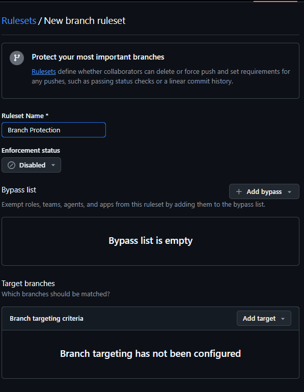
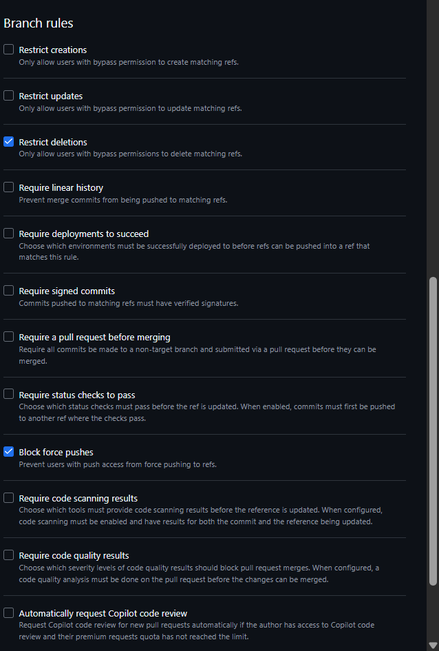

 docs/update-readme

 main

cara

# Proyek Praktikum Git - Adyatma Arya Wisnugroho

## Deskripsi Proyek
Proyek ini adalah pengembangan website profil sederhana untuk mempraktikkan alur kerja Git (Git Workflow).

## Cara Menjalankan
1. Clone repositori ke lokal.
2. Buka file `index.html` di browser pilihan Anda.

## Dokumentasi Perintah Git
| Perintah | Fungsi |
| :--- | :--- |
| `git checkout -b` | Membuat branch baru untuk pengerjaan fitur. |
| `git merge` | Menggabungkan perubahan dari branch lain ke branch saat ini. |
| `git rebase -i` | Merapikan riwayat commit dengan teknik squash. |
| `git add` | Menambahkan perubahan file ke staging area. |
| `git commit` | Menyimpan perubahan secara permanen ke dalam database Git. |
